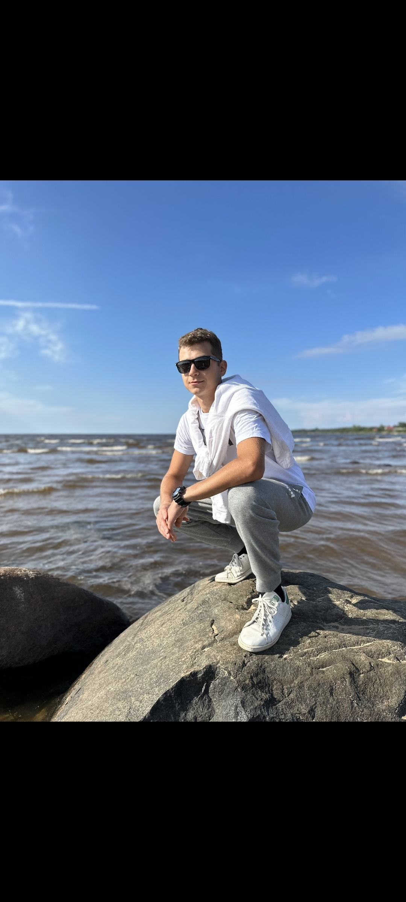

# Below, there is my short bio about me and my interests.

### Hello, dear ladies, respectable men and non-binary persons!

I am here just for introduce you to my life and show you what is the human brain is capable for.
This is my first project on GitHub Pages.
My goal is to impress all of you that reading this.
Each subsequent project of my studying process will be better and better until I will reach the perfectness. I will do everything for this.

I studied in Medical University named I.I.Mechnikova for 3 years. I wanted to be a surgeon in cardiology, but my "columnae vertebralis" didnt allow me to do it. My dreams had broken to the rocks. Then I ended this study with broken heart only to find my true way in this life. 

After the medical university i had go to the agrarian universuty in Pushkin city. I had studying there for 3 years too. I got that this profession has no perspective in our time. I needed to go to the study that could help me to get the modern profession.

And that's how i ended up here. Im glad to study in netology, this school will help me to get the profession of my life from my dreams. I want to be a homeworking python-programmer(preferably), because i like to have a distantion from work, this is my comfortable zone.

I love fishing at the countryside. The river flows through my  village. Like to ride on a bike a lot through the different landscapes up to 10 kilometers for a day.